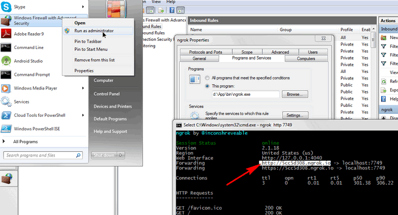

## block chain technology
### [intro to bitcoin](https://www.blognone.com/node/35180)
* address ยาว 34 characters ทุก address มี private key ของตัวเอง
* have 8 digits accuracy
* all transaction are publicly
* use SHA256 for each block it chain
* new block in every 10 minutes
* hash of (blok hash + last block id + nonce) = new block id
* evaluate new block difficulty (000000 in hash) every 2016 block
* use to have maximum of 6 parallel block (guaranty correctness in 1 hour)
* **each block will refer previous block** that's why it's call chain
* miner who generate new block will get 50 BTC. and reduce to half every 210,000 block
* ผู้โอน can give fee to miner to include their transcaction in new block
* 2nd post of intro https://www.blognone.com/node/47074
* version 0.8 used to have bug
#### ethereum
* https://www.blognone.com/node/77644
* evm - ethereum virtual machine compute task and got gas (fee)
* wallet, share, derivative ...
* 11 bank run it on Azure

## [ngrok](https://ngrok.com/)
> to get public URL for your local app
* download exe file
* run it `ngrok http 7749` where 7749 is your port number
* if it cannot online, your firewall may block it. Enable it

* test access your web from URL
